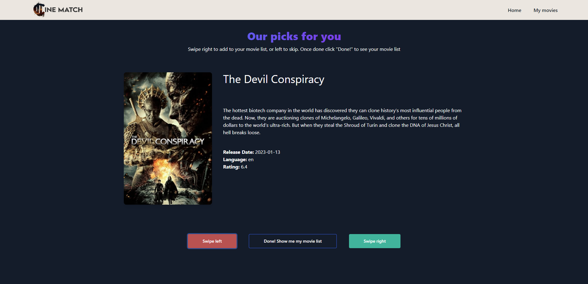

# CineMatch

## Description

CineMatch is a website where you can find your perfect movie match.

As a user, you visit the site and choose to search for movies by selecting between one and three options. You can choose type of movie, year of release and language.
Once you search by your choice(s) you are shown a list of movie options one by one. Just like with Tinder, you can swipe left to get rid of the choice or swipe right to keep your movie choice.
The movies you have swiped right on are kept in a shortlist so you can review them.

## Screenshots





## Links
Link to app:

- https://cinematch.netlify.app/


Presentation:

- https://docs.google.com/presentation/d/1UJXsa_gXuaGNg8oANExOqX8CXPnlnltEicAQ-8yryU4/edit

Source Code:

- https://github.com/wagnerona/cine-match-app

## Contents

- [User Story](#user-story)
- [Usage](#Usage)
- [Technologies](#technologies)
- [License](#License)
- [Tests](#Tests)
- [External Resources](#external-resources)
- [Questions](#questions)

## User Story

```text
As A Movieholic
I WANT to swipe on movie recommendations based on some specific categories
So THAT I can have a list of movies to watch for the weekend or a movie night
```

## Usage

On the home page you click on the button that says Let's Go. You are then taken to the three search fields.
Enter up to three choices through which you can search for a movie you'd like to watch.
This website uses React, Tailwind CSS, local storage.

### Technologies

`React JS`<br>
`Node JS`<br>
`Tailwind CSS`<br>
`The Movie Database (TMDB) API` <br>

## License

[](https://opensource.org/licenses/MIT)

## Tests

We have tested this through deploying it on Netlify and through compiling it through React.

## External Resources

[Figma Wireframe](https://www.figma.com/proto/dN63TOYt8OoJoHuMUL0hp4/Untitled?node-id=3-106&scaling=scale-down&page-id=0%3A1&starting-point-node-id=3%3A106&show-proto-sidebar=1) <br>
[Presentation](https://docs.google.com/presentation/d/1UJXsa_gXuaGNg8oANExOqX8CXPnlnltEicAQ-8yryU4/edit?usp=sharing)

## Questions

Contact the developers with any questions at the following email addresses:<br>
📧 [Wagner](mailto:wagneroprd@gmail.com),<br>
📧[Joanna](mailto:jo.stillawake@gmail.com),<br>
📧[Sinthiya](mailto:sinthiya.islamjuly35@gmail.com), <br>
📧[Fiona](mailto:fitzfinoo@gmail.com) <br>
